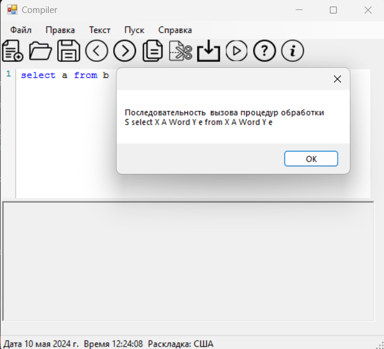
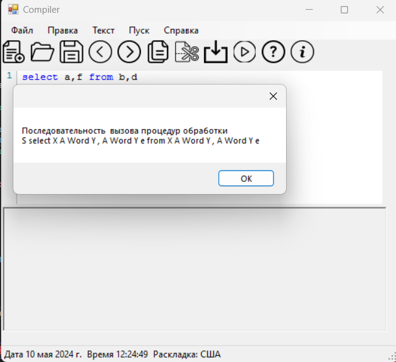
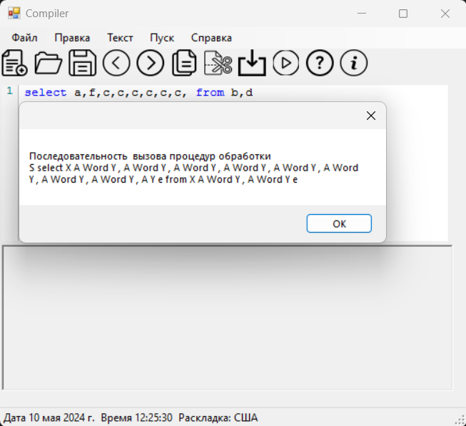
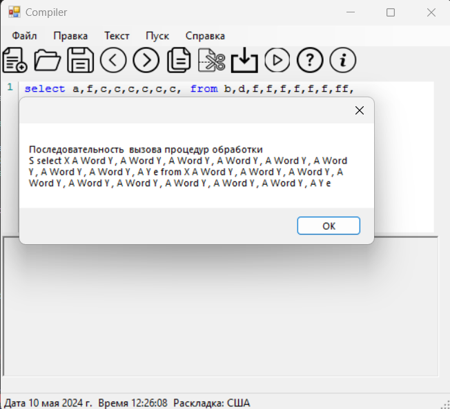

# Лабораторная работа №7
# Вариант 4
## Грамматика
G[S]:
1. S → select X from X
2. X → AY
3. Y → ,AY | ɛ
4. A → letter {letter}
letter → {a, b, c, ...z, A, B, …, Z}
## Язык
L(G[STMT]) = {select (letter [,letter])^n from (letter [,letter])^k n>0 k>0 | n > 0 m>=0 k>0}
## Классификация грамматики
Контексто-свободная
## Тестовые примеры

